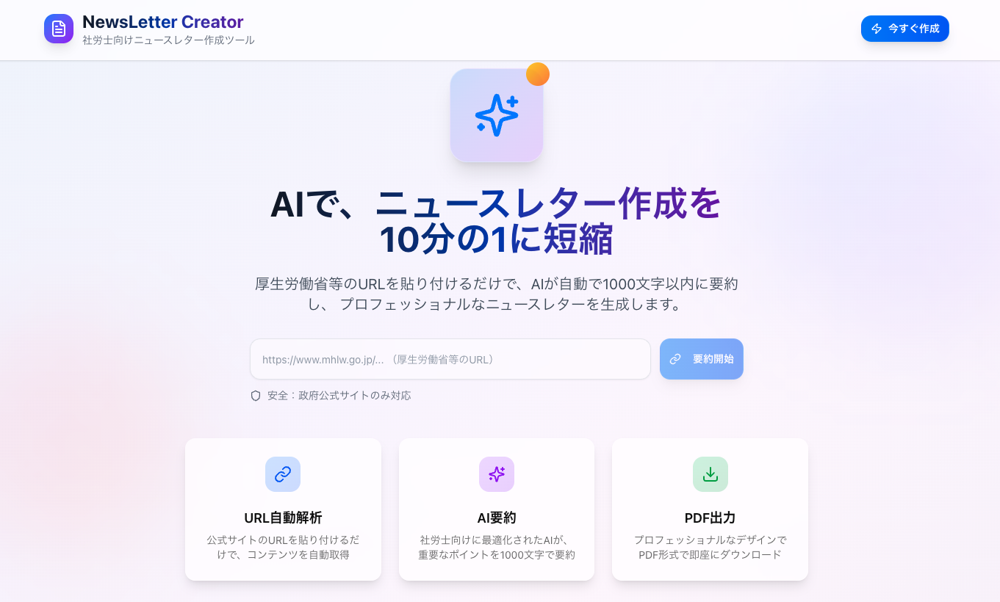

# 社労士の私がAIで作った！ニュースレター作成アプリ開発体験記

## はじめに：先輩社労士からの相談

先日、先輩の社労士から「ニュースレター作成アプリが欲しい」という相談を受けました。社労士事務所では毎月顧問先向けにニュースレターを配信することが多いのですが、その作成に手間がかかるという悩みは私も共感できるものでした。

そこで、プログラミング未経験の私が、AIを使ってウェブで動くニュースレター作成アプリを開発してみることにしました。

## プログラマーではない私がアプリを作れた理由

最初にお断りしておきますが、私は社労士であってプログラマーではありません。しかし、今のAIツールは本当にすごく、コードが書けなくてもアプリが作れる時代になっています。

これは「バイブコーディング」と呼ばれる手法で、AIと一緒にプログラミングをする新しい開発スタイルです。私のような初心者でも、業務効率化のアイデアがあれば、それを形にできてしまうのです。

## 開発したアプリの機能

開発したニュースレター作成アプリの使い方はとてもシンプルです：

1. **URLをコピー** - 厚生労働省などの公式サイトから、例えば「遺族年金の改正」のような情報ページのURLをコピー
2. **アプリに貼り付け** - 作成したアプリにURLを貼り付ける
3. **ボタンをクリック** - 「要約開始」ボタンを押す
4. **完成** - 1000文字以内のニュースレターが自動生成され、PDFでダウンロード可能

AIがウェブページの重要な部分を読み取り、要約してニュースレター形式に整えてくれます。社労士事務所で必要な「事務所便り」が簡単に作成できるようになりました。

**アプリはこちらから試せます**: [Newsletter Creator](https://newsletter-creator-4qnb.vercel.app/)

## 開発にかかった時間と使用ツール

### 使用したAIツール
- **Claude Code** - Anthropic社のAI開発支援ツール

### 開発時間
- **トータル：約4時間**
  - アプリの設計
  - コーディング
  - エラー修正
  - インターネットへのデプロイ（公開）

4時間で設計から公開まで完了できたのは、自分でも驚きでした。

## 開発過程での学び

### プログラミング未経験でも大丈夫だった理由

1. **AIが全面的にサポート** - コードの書き方を知らなくても、「こういうアプリが欲しい」と伝えるだけでAIがコードを生成
2. **エラー対応もAIにお任せ** - エラーが出たときは、スクリーンショットをAIに見せれば解決策を提示してくれる
3. **日本語で対話しながら開発** - 専門用語を知らなくても、普通の日本語で要望を伝えられる

### 多少の学習は必要

ただし、完全にゼロ知識でできるわけではありません：
- バイブコーディングの基本的な流れ
- エラーが解決しない時の対処法のコツ
- 基本的なウェブアプリの仕組み

これらは少し勉強する必要がありますが、プログラミング言語を一から学ぶよりもはるかに簡単です。

## 経済的メリット：月3,000〜4,000円の節約

多くの社労士事務所では、ニュースレター作成・配信サービスに月額3,000〜4,000円を支払っています。このアプリを使えば、その費用が不要になります。

年間で考えると36,000〜48,000円の節約になり、開発にかけた4時間はすぐに元が取れる計算です。

## なぜ経営者にAI活用を勧めるのか

私は一経営者として、AIの活用を強く推奨しています。理由は以下の通りです：

### 1. できなかったことができるようになる
今まで外注していた作業や、諦めていた効率化が自分でできるようになります。

### 2. 従業員の生産性が飛躍的に向上
経営者がAIの可能性を理解すれば、従業員にも教えたくなるはずです。従業員がAIを使いこなせるようになれば、組織全体の生産性が大幅に向上します。

### 3. アイデアをすぐに形にできる
「こんなツールがあったら便利なのに」というアイデアを、その場で実現できます。

## 今後の展望

今回の経験を通じて、AIを使った開発の可能性を強く感じました。今後は：

- 自分の業務で使えるアプリを思いついたらすぐに作る
- 同業者から「こういうアプリが欲しい」という要望があれば積極的に開発
- 業界全体の効率化に貢献していく

このような活動を続けていきたいと考えています。

## まとめ：AIを学ぶことから始めよう

AIの使い方を学ぶことは、社労士だけでなく、すべての経営者にとって必須のスキルになってきています。プログラミングができなくても、AIを活用すれば業務効率化のツールを自分で作ることができます。

私も初心者からスタートしました。AIを使った業務効率化に興味がある方は、ぜひ無料相談をご利用ください。一緒に、できなかったことをできるようにしていきましょう。

---

**お問い合わせ**
AIを活用した業務効率化にご興味のある方は、お気軽にご相談ください。
[無料相談のご予約はこちら]

**タグ**: #AI活用 #業務効率化 #社労士 #ニュースレター #アプリ開発 #ClaudeCode #プログラミング初心者 #経営者向け #コスト削減 #生産性向上